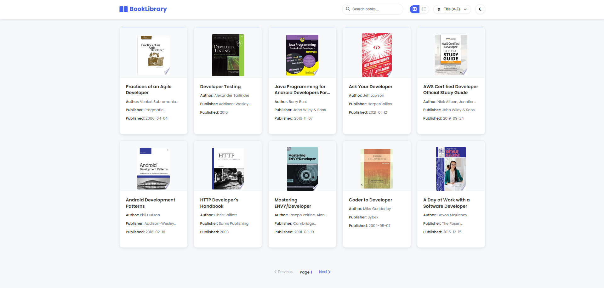

# 📚 Book Listing Application

A web application that displays books from a public API with various viewing and sorting options.

---

## 🌐 Live Demo

Check out the live application here: [Book Library App Live Demo](https://67ec42e2bb9c6d7a53adf72a--shimmering-blancmange-f86cd0.netlify.app/book-library-app/)

---

## 📸 Preview

  

---

## 🚀 Features

- View books in grid or list layout
- Dark/light theme toggle (persists between sessions)
- Search for books by title
- Sort books by:
  - Title (A-Z or Z-A)
  - Publication date (newest or oldest first)
- Pagination support
- Responsive design

---

## ⚙️ Technical Details

- Uses the FreeAPI Books API
- Built with Vanilla JavaScript (no frameworks)
- Styled with responsive CSS
- Utilizes LocalStorage for theme preference persistence

---

## 🔗 API Reference

This application uses the [FreeAPI Books API](https://www.freeapi.app/api/v1/public/books).