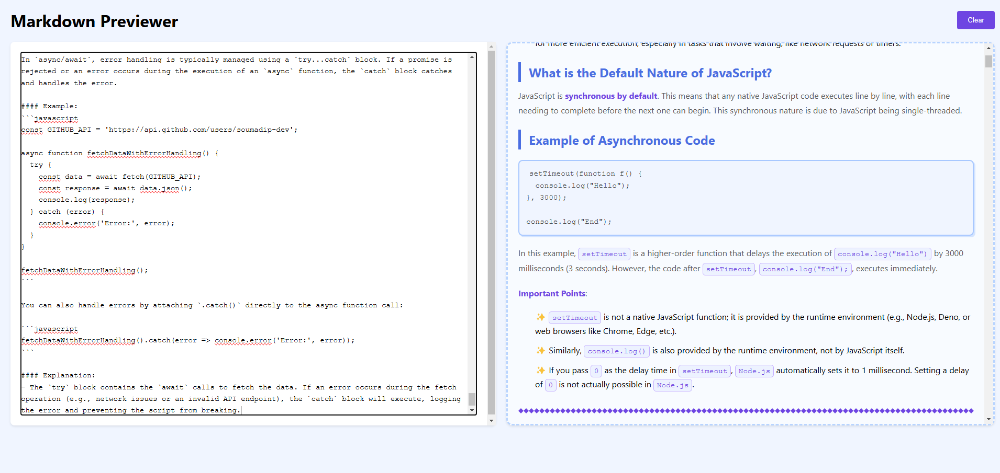
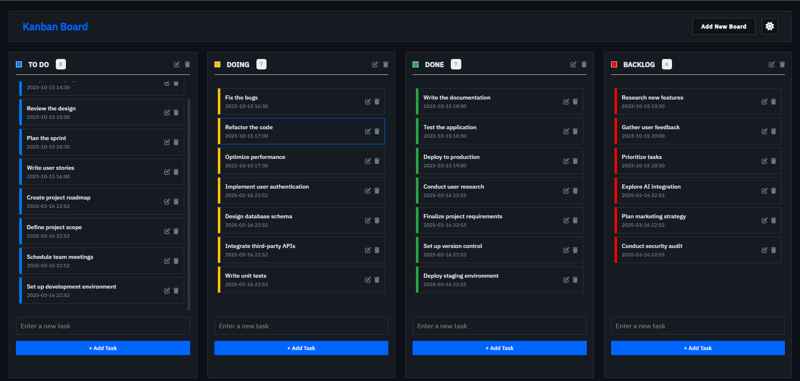

<h1 align="center">
  <br>
  VanillaJS Playground
  <br>
</h1>

<h3 align="center" style="margin: 20px 0;">
  A hands-on playground for learning core JavaScript concepts using pure (vanilla) JavaScript through small interactive projects
</h3>

---

## 📦 Projects

<div align="center">

|                                                                                                                                                                                                                                                                                                                        |                                                                                                                                                                                                                                                                                            |
| :--------------------------------------------------------------------------------------------------------------------------------------------------------------------------------------------------------------------------------------------------------------------------------------------------------------------: | :----------------------------------------------------------------------------------------------------------------------------------------------------------------------------------------------------------------------------------------------------------------------------------------: |
|            <div align="center"><br>📚 **[Book Listing Application](./Book-Library-App/)**<br>View, search, and sort books using a public API.<br><br></div>             | <div align="center"><br>📝 **[Markdown Previewer](./Markdown-Previewer)**<br>Real-time Markdown editor with live preview.<br><br></div> |
|         <div align="center"><br>💬 **[Random Quote Generator](./Random-Quote-Generator/)**<br>Generate and share quotes dynamically.<br><br></div>          | <div align="center"><br>📋 **[Kanban Board](./Kanban-Board)**<br>Interactive task management board with drag-and-drop support.<br><br></div>  |
|                 <div align="center"><br>📋 **[Task Management App](./Task_Management_app)**<br>Manage and track daily tasks efficiently.<br><br></div>                  |        <div align="center"><br>🛒 **[Simple Cart](./Simple_Cart)**<br>A basic shopping cart implementation using vanilla JS.<br><br></div>         |
| <div align="center"><br>⏳ **[Analog & Digital Clock](./Analog_Digital_Clock)**<br>Real-time analog and digital clock using JavaScript timers.<br><br></div> |               <div align="center"><br>✖️ **[Calculator](./Calculator)**<br>A basic calculator for arithmetic operations.<br><br></div>               |
|                     <div align="center"><br>⚖️ **[BMI Calculator](./BMI_Calculator)**<br>Calculate Body Mass Index using form inputs.<br><br></div>                      |  <div align="center"><br>📝 **[Email Validator](./Email_Validator)**<br>Validate email addresses using JavaScript and APIs.<br><br></div>  |

</div>

---

## 🛠️ Installation

```bash
git clone https://github.com/soumadip-dev/VanillaJS-Playground.git
cd VanillaJS-Playground
```
