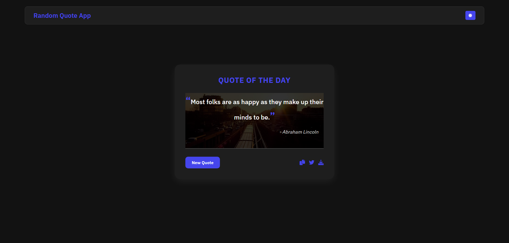

# 📝 Random Quote Generator

A simple JavaScript app that fetches and displays random quotes with sharing and export options.

---

## 🌐 Live Demo

Check out the live application here: [Random Quote Generator Live Demo](https://67ec42e2bb9c6d7a53adf72a--shimmering-blancmange-f86cd0.netlify.app/random-quote-generator/)

---

## 📸 Preview

  

---

## 🚀 Features

- **Random Quote Generation** – Fetches and displays a new random quote with each click
- **Dark/Light Mode** – Toggle between dark and light themes (persists between sessions)
- **Copy to Clipboard** – Easily copy quotes with a single click
- **Share on Twitter** – Instantly share your favorite quotes on Twitter
- **Export as Image** – Download quotes as an image for easy saving or sharing
- **Responsive Design** – Works seamlessly on all devices

---

## ⚙️ Technical Details

- Built with Vanilla JavaScript (no frameworks)
- Modern CSS with CSS variables for theming
- Utilizes LocalStorage for theme preference persistence
- Canvas API used for image export functionality

---

## 🔗 API Reference

This application uses the free [FreeAPI Quote API](https://api.freeapi.app/api/v1/public/quotes/quote/random).
